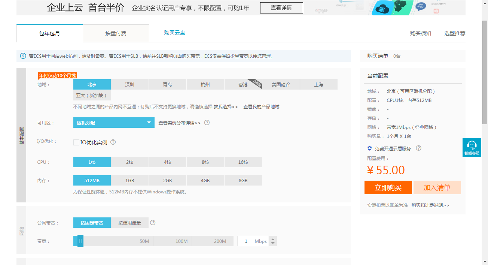
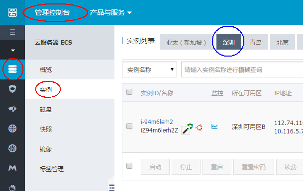
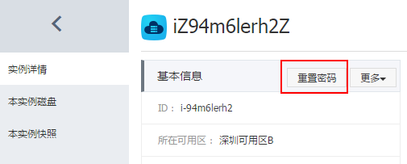
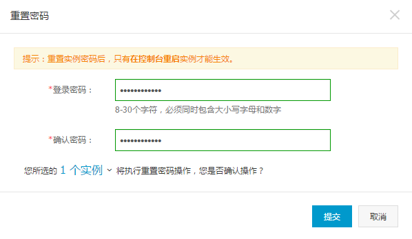
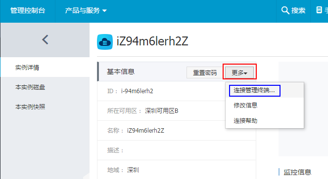
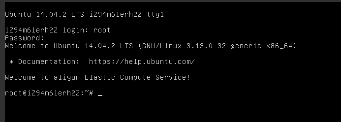

# 阿里云部署Django项目（超详细图文教程）
## Part1. 服务器购买和远程连接
## 前言：

花了一个月的空闲时间，终于成功把Django网站部署到了阿里云ECS上，包含以下功能：

- 不使用任何第三方工具，直接用网页连接阿里云ECS
- 使用GIT进行源码控制和上传到服务器
- 使用git hooks实现自动部署
- 用的是时下比较流行的一套部署方案——Nginx, Gunicorn, virtualenv, supervisor and PostgreSQL
- 可以在同一台服务器上部署两个、甚至多个网站

**光说不练假把式，建议大家边看边操作！**

### 1. 申请阿里云服务器
*打开[阿里云ECS购买页面](http://s.click.taobao.com/t?e=m%3D2%26s%3DoXqaW8BMof0cQipKwQzePCperVdZeJviEViQ0P1Vf2kguMN8XjClAhqjqlb5%2F1QRo3LXBIiwY9G9bxOus5F1H7hoWH6iuiRcafepPYWKNwOB56JtIJT1gzDVuRn8ddiDsEVVC24eqozcHtRpEUy6RHVyxRO0gvF4QxJtmCgOmCLXl8Q7TEjBF%2BX11FSyvDCnQiv%2BJKjlPObGDmntuH4VtA%3D%3D)，并用淘宝账号登陆，可以按需购买。基础配置的话包月大约60元/月

在部署阶段也可以选择按使用流量付费，只需要32元/月，后续部署成功后进行配置升级

操作系统选择Ubuntu的最新版本
填写登陆密码(**也是服务器的root密码，非常重要**)
然后点击“立即购买”就可以了。
### 2. 进入管理控制台，查看实例列表

进入[管理控制台](https://ecs.console.aliyun.com/#/home)后，在左侧的工具条中选择“云服务器ECS”，选择“实例”就可以看到刚刚申请到的云服务器了（这里“实例”的意思就是云服务器）。   
*注意图中蓝色圈住的地方，一定要选择申请时的区域，才能看到服务器实例。*
### 3. 设置服务器用户密码
**如果在购买的时候设置了服务器密码可跳过此步**

点击服务器实例右侧的“管理”，进入实例详情

点击“重置密码”

阿里云要求密码需要同时包含__大小写字母和数字__

重置密码后需要重启服务器

注意查看服务器状态

重启成功后，会变成绿色的“进行中”。此时才可以进行下一步。
### 4. 连接服务器
在刚才“重置密码”的旁边有个“更多”按钮，点开下拉菜单即可找到“连接管理终端”的选项。

此时会弹出一个窗口，提示系统指定的终端管理密码，这个密码需要记住，在连接管理终端的时候需要输入。
成功后出现下面的界面，需要点击左侧下拉菜单中的“连接管理终端”

点击后出现输入服务器用户名和密码的命令行界面
用户名是__root__，密码是刚才重置密码时设置的密码。  
_PS: 输入密码时命令行不会显示输入内容，正确输入后回车就可以了。_

