阿里云部署Django项目（超详细图文教程）
======================================

Part1. 服务器购买和远程连接
---------------------------

前言：
------

花了一个月的空闲时间，终于成功把Django网站部署到了阿里云ECS上，包含以下功能：

-  不使用任何第三方工具，直接用网页连接阿里云ECS
-  使用GIT进行源码控制和上传到服务器
-  使用git hooks实现自动部署
-  用的是时下比较流行的一套部署方案——Nginx, Gunicorn, virtualenv,
   supervisor and PostgreSQL
-  可以在同一台服务器上部署两个、甚至多个网站

**光说不练假把式，建议大家边看边操作！**

1. 申请阿里云服务器
~~~~~~~~~~~~~~~~~~~

\*打开\ `阿里云ECS购买页面 <http://s.click.taobao.com/t?e=m%3D2%26s%3DoXqaW8BMof0cQipKwQzePCperVdZeJviEViQ0P1Vf2kguMN8XjClAhqjqlb5%2F1QRo3LXBIiwY9G9bxOus5F1H7hoWH6iuiRcafepPYWKNwOB56JtIJT1gzDVuRn8ddiDsEVVC24eqozcHtRpEUy6RHVyxRO0gvF4QxJtmCgOmCLXl8Q7TEjBF%2BX11FSyvDCnQiv%2BJKjlPObGDmntuH4VtA%3D%3D>`__\ ，并用淘宝账号登陆，可以按需购买。基础配置的话包月大约60元/月
|阿里云ECS购买|
在部署阶段也可以选择按使用流量付费，只需要32元/月，后续部署成功后进行配置升级
|按使用流量付费|

| 操作系统选择Ubuntu的最新版本
  填写登陆密码(\ **也是服务器的root密码，非常重要**)
  然后点击“立即购买”就可以了。 ### 2. 进入管理控制台，查看实例列表
  |服务器实例|
  进入\ `管理控制台 <https://ecs.console.aliyun.com/#/home>`__\ 后，在左侧的工具条中选择“云服务器ECS”，选择“实例”就可以看到刚刚申请到的云服务器了（这里“实例”的意思就是云服务器）。
| *注意图中蓝色圈住的地方，一定要选择申请时的区域，才能看到服务器实例。*
  ### 3. 设置服务器用户密码
  **如果在购买的时候设置了服务器密码可跳过此步**

| 点击服务器实例右侧的“管理”，进入实例详情 |这里写图片描述|
  点击“重置密码” |这里写图片描述|
  阿里云要求密码需要同时包含\_\_大小写字母和数字\_\_ |这里写图片描述|
  重置密码后需要重启服务器 |这里写图片描述| 注意查看服务器状态
  |这里写图片描述|
  重启成功后，会变成绿色的“进行中”。此时才可以进行下一步。 ### 4.
  连接服务器
  在刚才“重置密码”的旁边有个“更多”按钮，点开下拉菜单即可找到“连接管理终端”的选项。
  |这里写图片描述|
  此时会弹出一个窗口，提示系统指定的终端管理密码，这个密码需要记住，在连接管理终端的时候需要输入。
  成功后出现下面的界面，需要点击左侧下拉菜单中的“连接管理终端”
  |这里写图片描述| 点击后出现输入服务器用户名和密码的命令行界面
  用户名是\_\_root\_\_，密码是刚才重置密码时设置的密码。
| *PS: 输入密码时命令行不会显示输入内容，正确输入后回车就可以了。*
  |这里写图片描述|

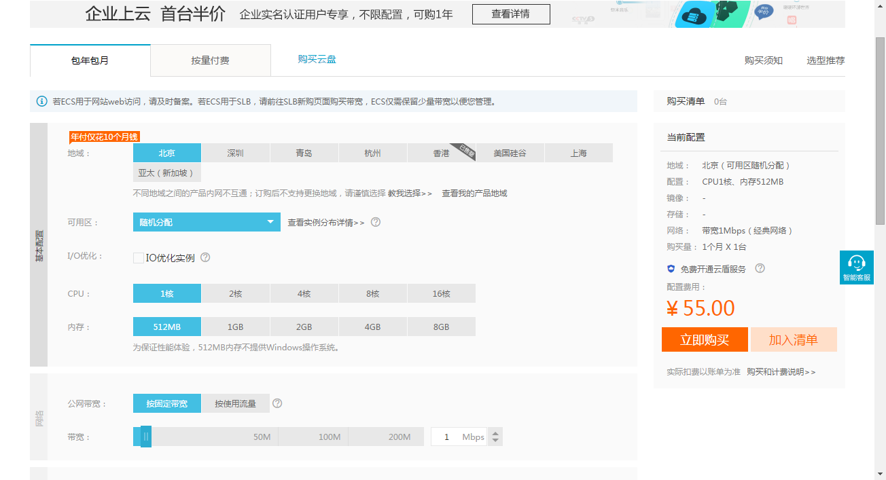
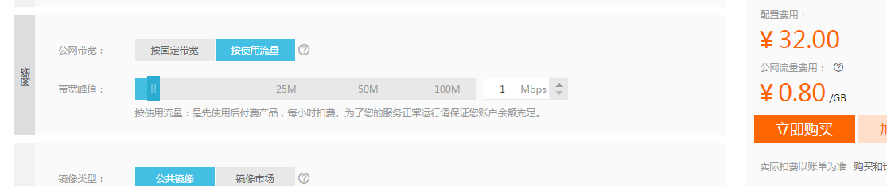
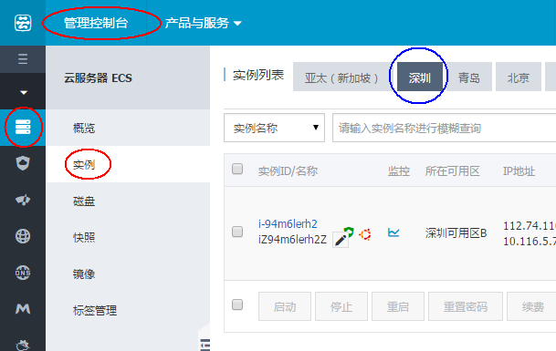
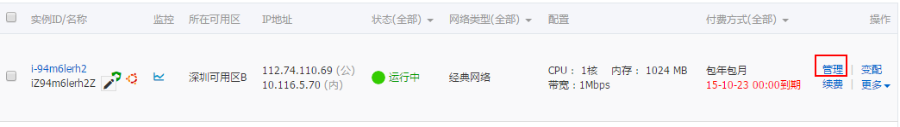
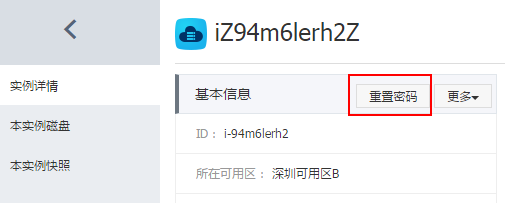
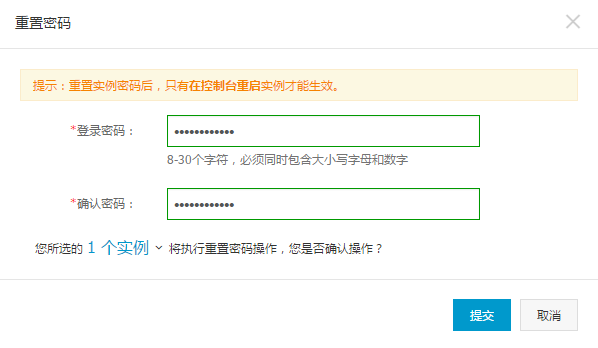
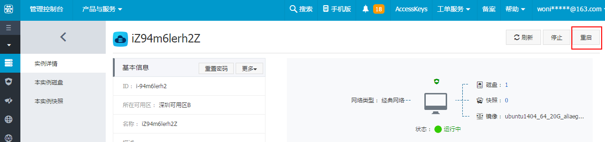
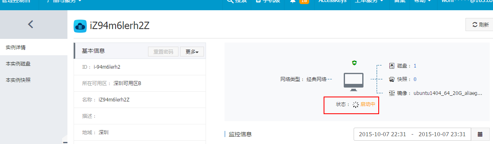
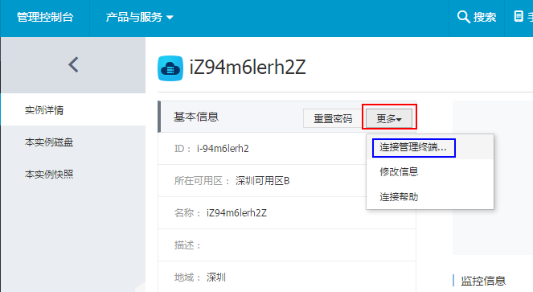
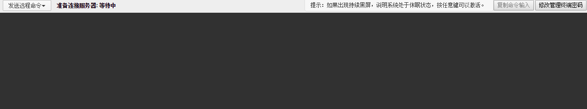
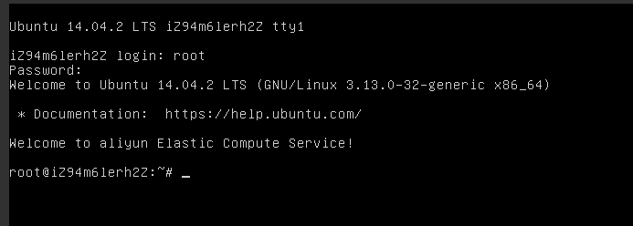
